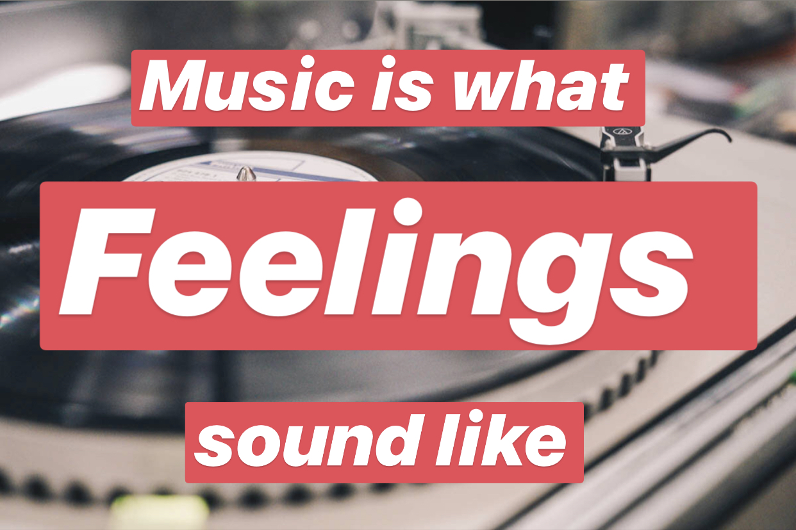

# Applied Data Science @ Columbia
## Fall 2019
## Project 1:  Can you feel the emotions of songs?



### [Project Description](doc/Proj1_desc.md)
This is the first and only *individual* (as opposed to *team*) this semester. 

Term: Fall 2019

+ Projec title: Sentiments analysis for different songs
+ This project is conducted by [Nuanjun Zhao]

+ Project summary: [a short summary] Songs contains more negative words compared to positive words. For positive sentiments, there is a word that is most obvious. It's love. Sentiments for different music genres, ages differs. Lyrics lengths for different sentiments vary as well. Genres, ages and lyrics lengths are all connected to sentiments of songs. If we want to do further study on lyrics, we can think about genres, ages and lyrics lengths.

Following [suggestions](http://nicercode.github.io/blog/2013-04-05-projects/) by [RICH FITZJOHN](http://nicercode.github.io/about/#Team) (@richfitz). This folder is orgarnized as follows.

```
proj/
├── lib/
├── data/
├── doc/
├── figs/
└── output/
```

Please see each subfolder for a README file.
