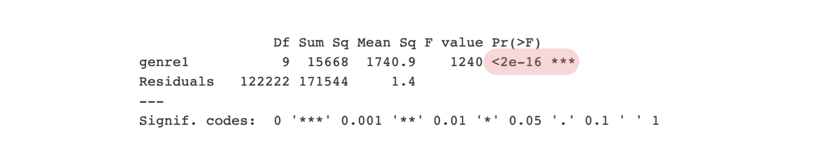
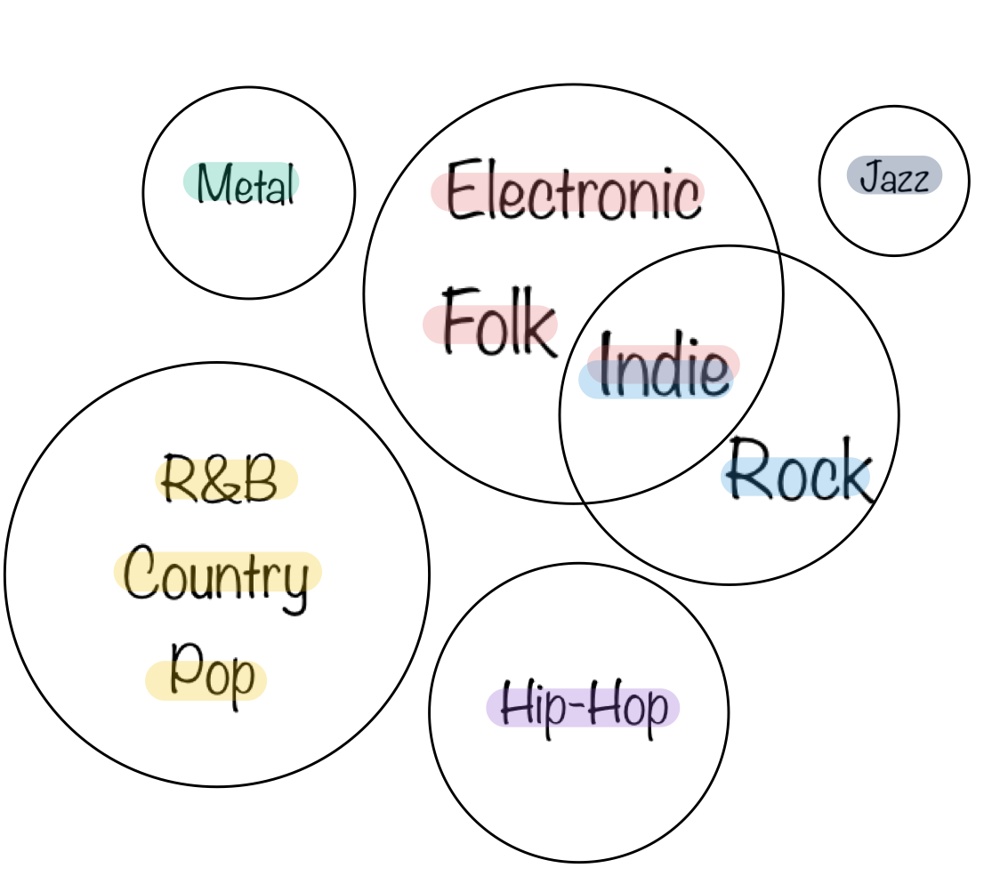
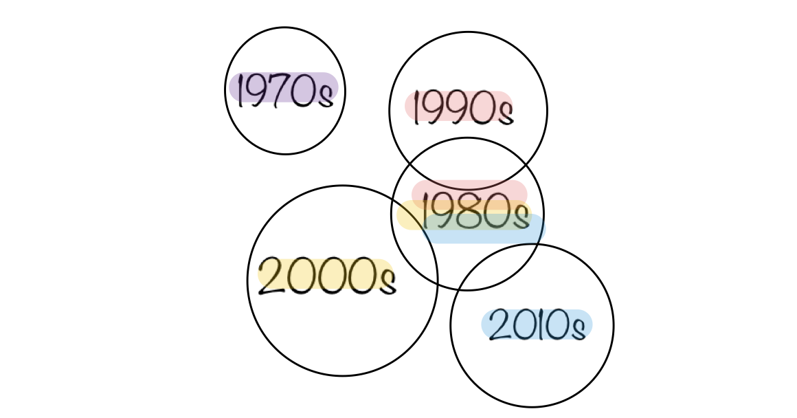
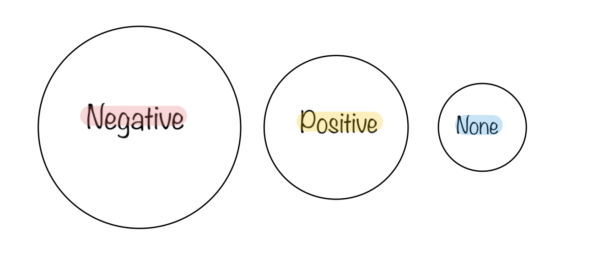
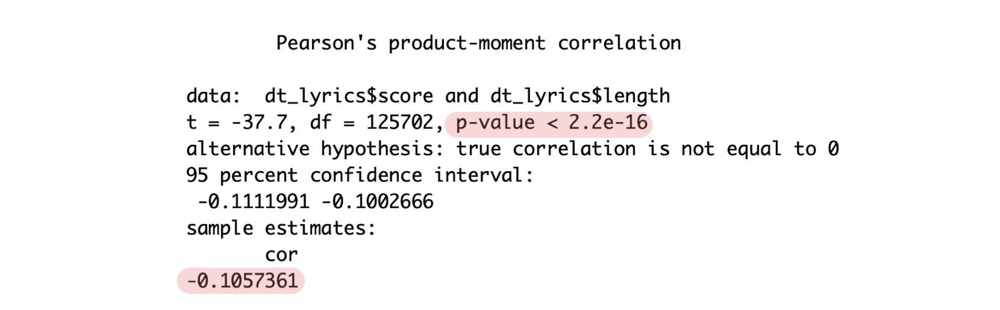

```{r echo=FALSE, out.width="100%", fig.align='center'}
knitr::include_graphics("../figs/music.jpg")
```

Music is everywhere around us. Have you ever open music apps when you have some emotions? Or is there any feeling coming to your mind when you are listening to music? I bet both are your situations! Melody and lyrics are both essential for a song. Good lyrics lead to strong emontions. Using lyrics data, which contains songs' names, years, artists, music genres and lyrics, let's find out the sentiments of songs and lyrics.

```{r echo=FALSE, message=FALSE, include= FALSE}
packages.used=c("tidytext", "tidydata", "dplyr", 
                "stringr", "plotly", "DT",
                "tm", "data.table", "scales", 
                "wordcloud2", "gridExtra", "RColorBrewer",
                "ngram", "tidyr", "ggplot2","wordcloud","reshape2")

# check packages that need to be installed.
packages.needed=setdiff(packages.used, 
                        intersect(installed.packages()[,1], 
                                  packages.used))
# install additional packages
if(length(packages.needed)>0){
  install.packages(packages.needed, repos = "http://cran.us.r-project.org", dependencies = TRUE)
}
# Load all the required libraries
library(tidytext)
library(textdata)
library(dplyr)
library(stringr)
library(plotly)
library(DT)
library(tm)
library(data.table)
library(scales)
library(wordcloud2)
library(gridExtra)
library(ngram)
library(tidyr)
library(ggplot2)
library(RColorBrewer)
library(wordcloud)
library(reshape2)
```

```{r echo=FALSE}
# Load the processed lyrics data
load('../output/processed_lyrics.RData') 
```

## Basic sentiment analysis

There are several sentiment dictionaries built in R for evaluating the words emotions in text. The nrc lexicon categorizes words into categories of positive, negative, anger, anticipation, disgust, fear, joy, sadness, surprise, and trust. The bing lexicon categorizes words  into positive and negative. The AFINN lexicon assigns words with a score between -5 and 5, with negative scores representing negative sentiment and positive scores for positive sentiment. First, I should find whether the words are positive or negative and what the words are. Then, I use bing lexicon to get the dictionary and then match the words with our dataset.

### Find negative and positive words in lyrics

```{r warning=FALSE, echo=FALSE,message=FALSE}
corpus<- VCorpus(VectorSource(dt_lyrics$stemmedwords))
word_tibble<- tidy(corpus) %>%
  select(text) %>%
  mutate(id = row_number()) %>%
  unnest_tokens(word, text)
bing_pos<-get_sentiments("bing") %>% 
  filter(sentiment=="positive")
bing_neg<-get_sentiments("bing") %>% 
  filter(sentiment=="negative")
count_pos<-word_tibble %>%
  inner_join(bing_pos) %>%
  count(word)
count_neg<-word_tibble %>%
  inner_join(bing_neg) %>%
  count(word)
```
First, find the numbers of the positive words and negative words in lyrics.

The total number of postive words in the stemmed lyrics using bing lexicon is:
```{r warning=FALSE, echo=FALSE}
sum(count_pos$n)
```

The total number of negative words in the stemmed lyrics using bing lexicon is:
```{r warning=FALSE, echo=FALSE}
sum(count_neg$n)
```

From the numbers calculated, I find negative words are more than positive words in lyrics. This result is consistent with our common sense that artists create music mostly when they have bad feelings and music is a way to speak it out.

Using all the stemmed lyrics from dataset, the top 10 most frequent negative words and positive words are as follows:

```{r echo=FALSE, message=FALSE, warning= FALSE,out.width="80%", fig.align='center'}
bing_word_counts <- word_tibble %>%
  inner_join(get_sentiments("bing")) %>%
  count(word, sentiment, sort = TRUE)
bing_word_counts %>%
  group_by(sentiment) %>%
  top_n(10) %>%
  ungroup() %>%
  mutate(word = reorder(word, n)) %>%
  ggplot(aes(word, n, fill = sentiment)) +
  geom_col(show.legend = FALSE) +
  facet_wrap(~sentiment, scales = "free") +
  labs(y = "Contribution to sentiment",
       x = NULL) +
  coord_flip()
```

For negative words in all the lyrics, a song writer tends to use words like fall, die, lie, cry and so on to represent their negative feelings. And for postive sentiments, love is the most obvious word that artists use compared to all the others. Since after a quick look of the lyrics shinny app provided by our instrutor, it is not hard to find most songs contain the word love, which means love is a common topic and also the common positive sentiment in music.

The positive and negative wordclouds are as follows, which gives us a more straightforward visualization of the most commoon sentimental words among the lyric words.

```{r warning=FALSE, message=FALSE, echo=FALSE, out.width="80%", fig.align='center'}
word_tibble %>%
  inner_join(bing_pos) %>%
  count(word)%>% 
  with(wordcloud(word, n, max.words = 50,min.freq=1,
          random.order=FALSE,
          rot.per=0.3,
          use.r.layout=T,colors=c('coral3','coral','brown1')))
```
<p align="center">*Positive wordcloud*</p>
```{r warning=FALSE, message=FALSE, echo=FALSE, out.width="80%", fig.align='center'}
word_tibble%>%
  inner_join(bing_neg) %>%
  count(word) %>%
  with(wordcloud(word, n, max.words = 50,scale=c(4,0.5),min.freq=1,
          random.order=FALSE,
          rot.per=0.3,
          use.r.layout=T,
          random.color=FALSE,
          colors=brewer.pal(9,"BuGn")))
```
<p align="center">*Negative wordcloud*</p>

## Statistical tests
I use statistical tests including one way anova, correlation test and chi-square test to do further analysis. I want to discuss whether there is diffence for sentiments among several music genres and also music from different ages. Another interesting thing I can extract from the dataset is lyrics word lengths for every songs. Then, I start to think about whether the length has something to do with the three kinds of sentiments. Let's see the further analysis!

### Sentiments among different genres

I would like to collect all the positive and negative words of songs from different genres using bing lexicon, in the following bar chart, we can clearly see that if we set 0.5 as a boundry, metal and hip-hop music tend to include more negative words in the creation of songs while jazz has more positive sentiment.

```{r warning=FALSE, echo=FALSE, message = FALSE, out.width="80%", fig.align='center'}
afinn<-word_tibble%>%
  inner_join(get_sentiments("afinn"))
afinn$song<-factor(afinn$id)
score<-afinn%>%
  group_by(song)%>%
  summarise(score=mean(value))
score$id<-as.integer(as.character(score$song))
score<-score[,-1]
dt_lyrics<-left_join(dt_lyrics,score)
dt_lyrics$score[is.na(dt_lyrics$score)]<-0
lyrics1<-filter(dt_lyrics,genre!="Not Available")%>%
  filter(genre!="Other")
lyrics1$genre1<-factor(lyrics1$genre,levels=c("Folk", "R&B", "Electronic", "Jazz", "Indie", "Country", "Rock", "Metal", "Pop", "Hip-Hop"),ordered = TRUE)
corpus1 <- VCorpus(VectorSource(lyrics1$stemmedwords))
word_tibble1 <-  data.frame(genre=lyrics1$genre1,tidy(corpus1))%>%
  group_by(genre) %>%
  mutate(id = row_number()) %>%
  ungroup()%>%
  unnest_tokens(word, text)
count_pos1<-word_tibble1 %>%
  inner_join(bing_pos) %>%
  group_by(genre)%>%
  count(word)
n_pos<-count_pos1%>%
  group_by(genre)%>%
  summarise(n_pos=sum(n))
count_neg1<-word_tibble1 %>%
  inner_join(bing_neg) %>%
  group_by(genre)%>%
  count(word)
n_neg<-count_neg1%>%
  group_by(genre)%>%
  summarise(n_neg=sum(n))
count_senti<-left_join(n_pos,n_neg)
npdata<-data.frame()
for(i in 1:nrow(count_senti)){
  dt<-data.frame(genre=factor(rep(count_senti$genre[i],count_senti$n_pos[i]+count_senti$n_neg[i])),senti=c(rep("positive",count_senti$n_pos[i]),rep("negative",count_senti$n_neg[i])))
  npdata<-rbind(npdata,dt)
  }
ggplot(npdata, aes(x = genre)) +
  geom_bar(aes(fill = factor(senti)), position = "fill")
```
Since the bar chart shows the sentiments of songs could be different among those genres, however, will the statistical tests give us the same conclusion?
First , I use Afinn lexicon to give a score to each words in the songs and then take mean as the sentiment score to evaluate the sentiment of the whole song. To test whether the sentiment ditributions or means for the genres are the same, first, we should see the normality of data and decide whether we can use t test. This is a histgram for sentiment scores of country genre. 
```{r warning=FALSE, echo=FALSE, message= FALSE, out.width="80%", fig.align='center'}
hist(lyrics1$score[lyrics1$genre=="Country"], main="histogram for sentiment scores of Country genre",xlab="scores",col="lightcoral",border ="indianred3" )
```
It seems like a normal distribution but I am not sure about it. Thus, I  use k-s test to examine the normality.
```{r warning=FALSE, echo=FALSE, message= FALSE,include=FALSE}
ks.test(lyrics1$score[lyrics1$genre=="Country"],"pnorm")
aov <- aov(score ~ genre1, data = lyrics1)
summary(aov)
TukeyHSD(aov)
```

```{r echo=FALSE, out.width="100%", fig.align='center'}

```
<p align="center">*The k-s test result for country genre*</p>

The result shows that the data from one of the genres is not normally distributed, we should turn to nonparamentric method, which is one-way analysis of variance.
```{r echo=FALSE, out.width="100%", fig.align='center'}

```
<p align="center">*One-way ANOVA result for genres*</p>

The small p-value tells us that the sentiment difference indeed exists. But I still don't know what genres cause the difference, so I use the Tukey HSD test to test the difference between every two genres. Getting the test results, I summarize it into this circle plots. Genres in the same color or in the same circle have something in common for sentiments. Subsequently, genres which are not in seperate circles cause the difference.
```{r echo=FALSE, out.width="100%", fig.align='center'}

```
<p align="center">*Genres classification*</p>

Because of the difference, I wonder if there is a relation between genres and sentiments. Then, I turn the sentiments scores into three categories "positive", "negative" and "none" and conduct chi-square test.
```{r warning=FALSE, echo=FALSE,include= FALSE}
lyrics1$senti<-ifelse(lyrics1$score<0,"negative","positive")
lyrics1$senti<-ifelse(lyrics1$score==0,"none",lyrics1$senti)
lyrics1$senti<-factor(lyrics1$senti)
mytable1<-xtabs(~senti+genre1, data=lyrics1)
chisq.test(mytable1)
mytable1
```

```{r echo=FALSE, out.width="100%", fig.align='center'}

```
<p align="center">*The result of chi-square test for sentiment and genre*</p>

Thus, genres and sentiments are dependent.

This is a heatmap of sentiments and genres. The darker the color, the higher frequency shows with that genre and sentiment.
```{r warning=FALSE, message= FALSE,echo=FALSE, out.width="80%", fig.align='center'}
tab1melt<-melt(mytable1)
ggplot(tab1melt, aes(x=senti,y=genre1))+
  scale_fill_gradient(low = "salmon",high = "red3")+
  geom_tile(aes(fill=value)) 
```

### Sentiments among different ages

I change the variable year into a categorical variable, and seperate the ages into 1970s, 1980s, 1990s, 2000s, 2010s. Then, I did the same steps as I analyze the sentiments among different music genres. Here are the results.
The bar chart for the positive and negative words of songs in different ages is as follows:
```{r warning=FALSE, message= FALSE, echo=FALSE, out.width="80%", fig.align='center'}
lyrics2<-dt_lyrics[dt_lyrics$year>=1970,]
lyrics2$ages<-ifelse(lyrics2$year<1980,"1970s","2010s")
lyrics2$ages<-ifelse(lyrics2$year>=1980,"1980s",lyrics2$ages)
lyrics2$ages<-ifelse(lyrics2$year>=1990,"1990s",lyrics2$ages)
lyrics2$ages<-ifelse(lyrics2$year>=2000,"2000s",lyrics2$ages)
lyrics2$ages<-ifelse(lyrics2$year>=2010,"2010s",lyrics2$ages)
lyrics2$ages<-factor(lyrics2$ages)
corpus2<- VCorpus(VectorSource(lyrics2$stemmedwords))
word_tibble2<- data.frame(ages=lyrics2$ages,tidy(corpus2)) %>%
  group_by(ages) %>%
  select(text) %>%
  mutate(id = row_number()) %>%
  unnest_tokens(word, text)
count_pos2<-word_tibble2 %>%
  inner_join(bing_pos) %>%
  group_by(ages)%>%
  count(word)
n_pos1<-count_pos2%>%
  group_by(ages)%>%
  summarise(n_pos=sum(n))
count_neg2<-word_tibble2%>%
  inner_join(bing_neg) %>%
  group_by(ages)%>%
  count(word)
n_neg1<-count_neg2%>%
  group_by(ages)%>%
  summarise(n_neg=sum(n))
count_senti1<-left_join(n_pos1,n_neg1)
npdata1<-data.frame()
for(i in 1:nrow(count_senti1)){
  dt1<-data.frame(ages=factor(rep(count_senti1$ages[i],count_senti1$n_pos[i]+count_senti1$n_neg[i])),senti=c(rep("positive",count_senti1$n_pos[i]),rep("negative",count_senti1$n_neg[i])))
  npdata1<-rbind(npdata1,dt1)
  }
ggplot(npdata1, aes(x = ages)) +
  geom_bar(aes(fill = factor(senti)), position = "fill")
```
We can see from the plot, there is just little difference for the ages. Because the data is not normal, we cannot use parametric way. However, after doing analysis of variance, we can still find that the difference does exist. 
```{r warning=FALSE, meassage= FALSE, echo=FALSE, out.width="80%", fig.align='center',include= FALSE}
#test preparation
hist(lyrics2$score[lyrics2$ages=="1970s"],main = "histogram of sentiment scores for music in 1970s",xlab = "scores",col="lightseagreen",border = "turquoise4")
```

```{r echo=FALSE, out.width="100%", fig.align='center'}

```
<p align="center">*One-way ANOVA result for ages*</p>

All ages except 1970s, have something in common with 1980s. The ages which are not in the same circle cause the diffence of sentiments.
```{r echo=FALSE, out.width="100%", fig.align='center'}

```
<p align="center">*Ages classifiction*</p>

```{r warning=FALSE, echo=FALSE,include= FALSE}
ks.test(lyrics2$score[lyrics2$ages=="1970s"],"pnorm")
aov1 <- aov(score ~ ages, data = lyrics2)
summary(aov1)
TukeyHSD(aov1)
```

```{r warning=FALSE, echo=FALSE,include= FALSE}
lyrics2$senti<-ifelse(lyrics2$score<0,"negative","positive")
lyrics2$senti<-ifelse(lyrics2$score==0,"none",lyrics2$senti)
lyrics2$senti<-factor(lyrics2$senti)
mytable2 <- xtabs(~senti+ages, data=lyrics2)
chisq.test(mytable2)
mytable2
```

```{r echo=FALSE, out.width="100%", fig.align='center'}

```
<p align="center">*The result of chi-square test for sentiment and age*</p>

Thus, the ages and sentiments are connected.
```{r warning=FALSE, message= FALSE,echo=FALSE, out.width="80%", fig.align='center'}
tab2melt<-melt(mytable2)
ggplot(tab2melt, aes(x=senti,y=ages))+
  scale_fill_gradient(low = "darkseagreen1",high = "lightseagreen")+
  geom_tile(aes(fill=value)) 
```

### Lyrics length

First, compute how many words in one song using original lyrics.
```{r echo=FALSE, message=FALSE}
corpus3<- VCorpus(VectorSource(dt_lyrics$lyrics))
word_tibble3<- tidy(corpus3)%>%
  select(text) %>%
  mutate(id = row_number()) %>%
  unnest_tokens(word, text)
word_tibble3$count<-rep(1,dim(word_tibble3)[1])
word_tibble3$song<-factor(word_tibble3$id)
dt_lyrics$length<-tapply(word_tibble3$count,word_tibble3$song,sum)
```
Change the sentiment score into categorical variable. Paramentric way is not applicable as well. One way anova shows the difference. 
```{r warning=FALSE, message= FALSE, include= FALSE, echo=FALSE, out.width="80%", fig.align='center'}
lyrics3<-dt_lyrics
lyrics3$senti<-ifelse(lyrics3$score<0,"negative","positive")
lyrics3$senti<-ifelse(lyrics3$score==0,"none",lyrics3$senti)
hist(lyrics3$length[lyrics3$senti=="positive"], main="histogram for songs' lyrics word length with positive sentiment",xlab="word length",col="lightskyblue",border ="deepskyblue" )
ks.test(lyrics3$length[lyrics3$senti=="positive"],"pnorm")
aov2 <- aov(length ~ factor(senti), data = lyrics3)
summary(aov2)
TukeyHSD(aov2)
```

```{r echo=FALSE, out.width="100%", fig.align='center'}

```
<p align="center">*Sentiments classifiction*</p>

The lyrics length differs for different sentiments. From Tukey HSD test, negative songs tend to have more words than positive songs.

```{r warning=FALSE, message= FALSE, include = FALSE, echo=FALSE, out.width="80%", fig.align='center'}
cor.test(dt_lyrics$score,dt_lyrics$length) 
```

```{r echo=FALSE, out.width="100%", fig.align='center'}

```
According to correlation test, lyrics length and emotion are related although the correlation is not large. Besides, they are negatively correlated, which also corresponds to the Tukey HSD test result.

## Summary
After basic sentiment analysis, we find that songs contain more negative words compared to positive ones. For the frequency of words, we find song writers use words more randomly to express negative emotion while for positive emotions, they are more likely to use *Love* instead of other positive words. 

To conclude, sentiments are related to music genres, music ages and music lyrics length.

For lyrics in different music genres, metal and hip-hop music show more negative feelings. And different genres may differ in sentiments. But R&B, pop and country music have something in common, so do electronic, folk and indie and indie and Rock. So, the music genres are connected to sentiments in lyrics. 

For music in different ages, sentiments vary as well. As time pass by, songs contains more negative feelings. Without old regulations, living in peace, people concentrates more on their negative feelings and they have courage to express in songs. Sentiments are related to time. 

There's also some relation between lyrics length and sentiments. More negative the song shows, more words will appear in this song.
